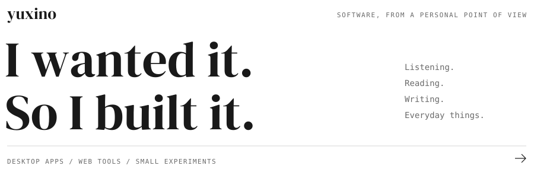
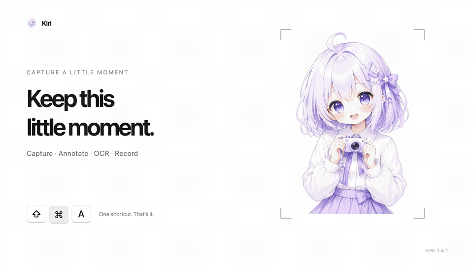
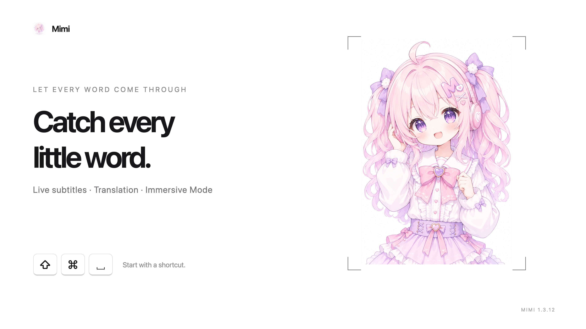
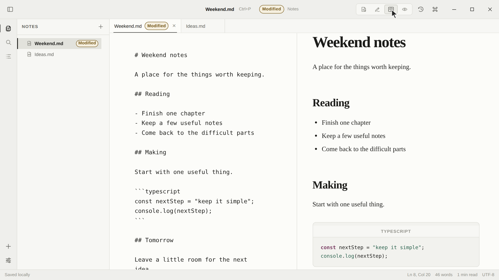
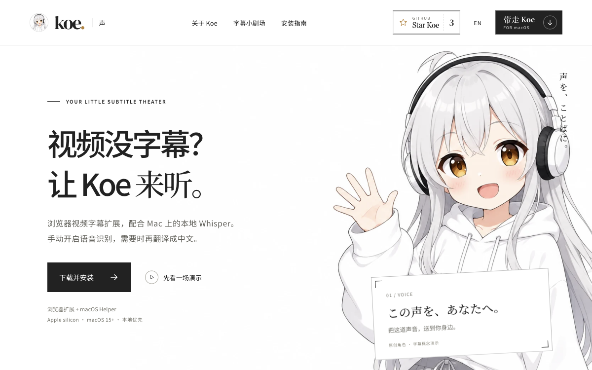
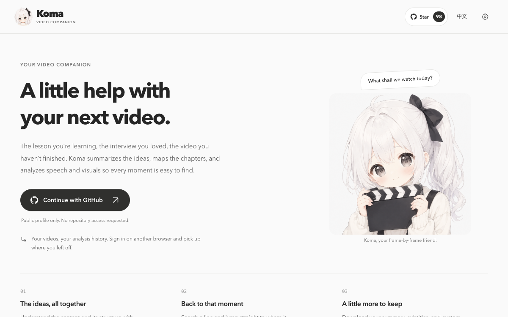
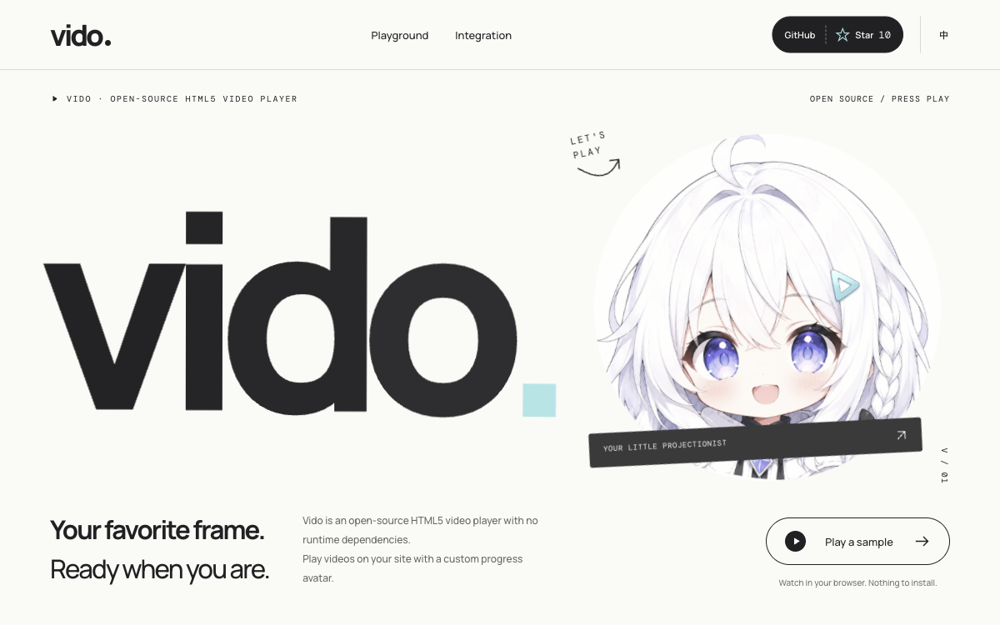
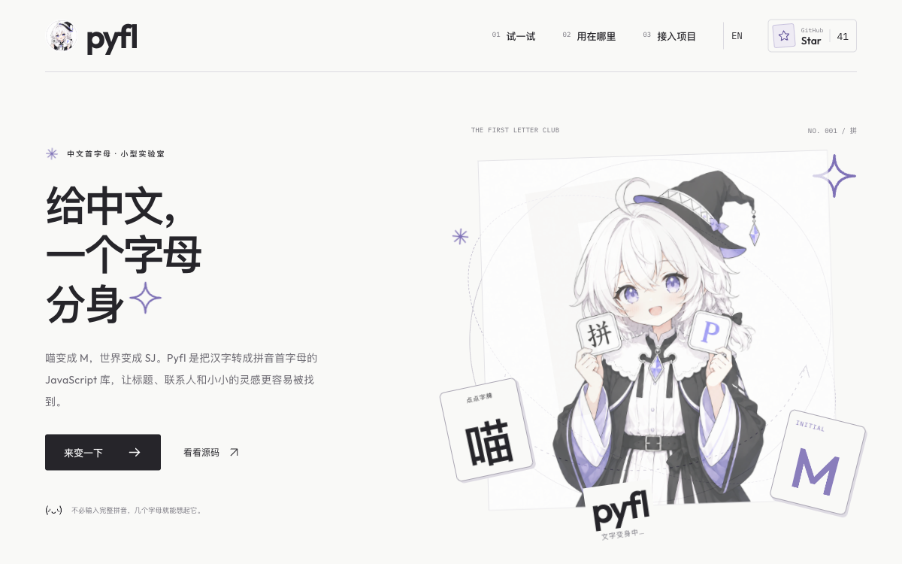
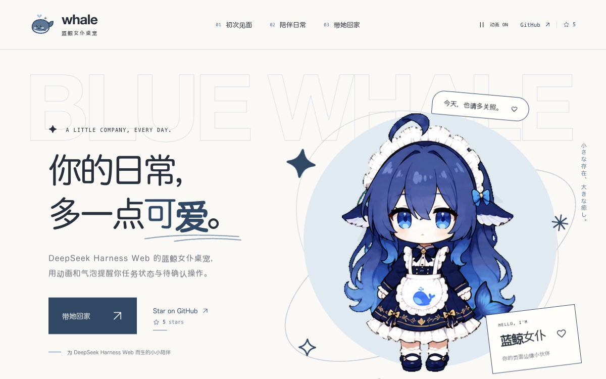

<picture>
  <source media="(prefers-color-scheme: dark)" srcset="assets/profile/intro-dark.svg">
  
</picture>

<table>
<tr>
<td width="50%" align="center" valign="top">
<h3> &nbsp; Kiri</h3>
<a href="https://kiri.yuxino.cn/"><picture><source media="(prefers-reduced-motion: reduce)" srcset="assets/profile/kiri-still.webp"></picture></a>

Capture, OCR & video editing. 截图、标注、录屏与剪辑。

<a href="https://kiri.yuxino.cn/">Website</a> &nbsp; · &nbsp; <a href="https://github.com/yuxino/kiri">Source</a>
</td>
<td width="50%" align="center" valign="top">
<h3> &nbsp; Mimi</h3>

Live audio translation. 系统声音实时字幕与翻译。

<a href="https://mimi.yuxino.cn/en/#demo">Website</a> &nbsp; · &nbsp; <a href="https://github.com/yuxino/mimi">Source</a>
</td>
</tr>
<tr>
<td width="50%" align="center" valign="top">
<h3> &nbsp; Satori</h3>
<a href="https://satori.yuxino.cn/"><picture><source media="(prefers-reduced-motion: reduce)" srcset="assets/profile/satori-still.png"></picture></a>

PDF reading & AI questions. PDF 阅读与框选问答。

<a href="https://satori.yuxino.cn/">Website</a> &nbsp; · &nbsp; <a href="https://github.com/yuxino/satori">Source</a> 
Mac / Windows · 中文界面 需自备兼容视觉模型
</td>
<td width="50%" align="center" valign="top">
<h3> &nbsp; Fuwa</h3>

Floating window mirrors. Mac 窗口镜像与鼠标穿透。

<a href="https://fuwa.yuxino.cn/">Website</a> &nbsp; · &nbsp; <a href="https://github.com/yuxino/fuwa">Source</a>
</td>
</tr>
<tr>
<td width="50%" align="center" valign="top">
<h3> &nbsp; Viva</h3>

Local Markdown editor. 本地编辑、预览与笔记搜索。

<a href="https://viva.yuxino.cn/">Website</a> &nbsp; · &nbsp; <a href="https://github.com/yuxino/viva">Source</a>
</td>
<td width="50%" align="center" valign="top">
<h3> &nbsp; Tick</h3>
<a href="https://tick.yuxino.cn/"><picture><source media="(prefers-reduced-motion: reduce)" srcset="assets/profile/tick-still.png"></picture></a>

Scheduled Node.js tasks. Mac 与 Windows 定时任务。

<a href="https://tick.yuxino.cn/">Website</a> &nbsp; · &nbsp; <a href="https://github.com/yuxino/tick">Source</a>
</td>
</tr>
<tr>
<td width="50%" align="center" valign="top">
<h3> &nbsp; Koe</h3>

Local Whisper subtitles. 浏览器字幕与可选中文翻译。

<a href="https://koe.yuxino.cn/">Website</a> &nbsp; · &nbsp; <a href="https://github.com/yuxino/koe">Source</a>
</td>
<td width="50%" align="center" valign="top">
<h3> &nbsp; Osu</h3>

iPhone subtitle translation. iOS 悬浮翻译，源码预览版。

<a href="https://github.com/yuxino/osu/blob/master/CONTRIBUTING.md">Build Osu</a> &nbsp; · &nbsp; <a href="https://github.com/yuxino/osu">Source</a>
</td>
</tr>
<tr>
<td width="50%" align="center" valign="top">
<h3> &nbsp; Koma</h3>

AI video analysis. 视频总结、章节与字幕导出。

<a href="https://koma.yuxino.cn/">Website</a> &nbsp; · &nbsp; <a href="https://github.com/yuxino/koma">Source</a>
</td>
<td width="50%" align="center" valign="top">
<h3> &nbsp; Vido</h3>

TypeScript video player. 零运行时依赖的网页播放器。

<a href="https://vido.yuxino.cn/en.html">Website</a> &nbsp; · &nbsp; <a href="https://github.com/yuxino/vido">Source</a>
</td>
</tr>
<tr>
<td width="50%" align="center" valign="top">
<h3> &nbsp; Pyfl</h3>

Chinese pinyin initials. 拼音首字母与多读音搜索。

<a href="https://pyfl.yuxino.cn/">Website</a> &nbsp; · &nbsp; <a href="https://github.com/yuxino/pyfl">Source</a>
</td>
<td width="50%" align="center" valign="top">
<h3> &nbsp; Blue Whale Maid</h3>

DSH Web companion. 任务提醒、余额与费用估算。

<a href="https://whale.yuxino.cn/">Website</a> &nbsp; · &nbsp; <a href="https://github.com/yuxino/dsh-blue-whale-maid">Source</a>
</td>
</tr>
</table>

[Doro](https://github.com/yuxino/doro) &nbsp; · &nbsp; [WeChat](https://github.com/yuxino/WeChat) &nbsp; · &nbsp; [2048](https://github.com/yuxino/2048)
