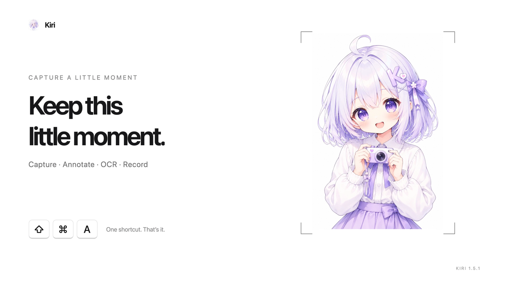
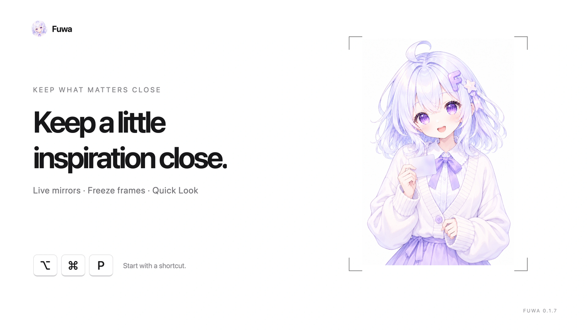
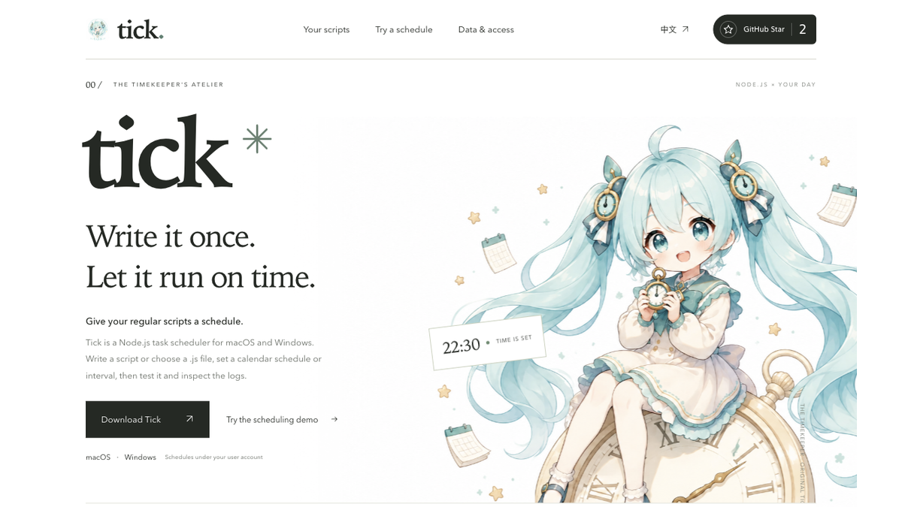
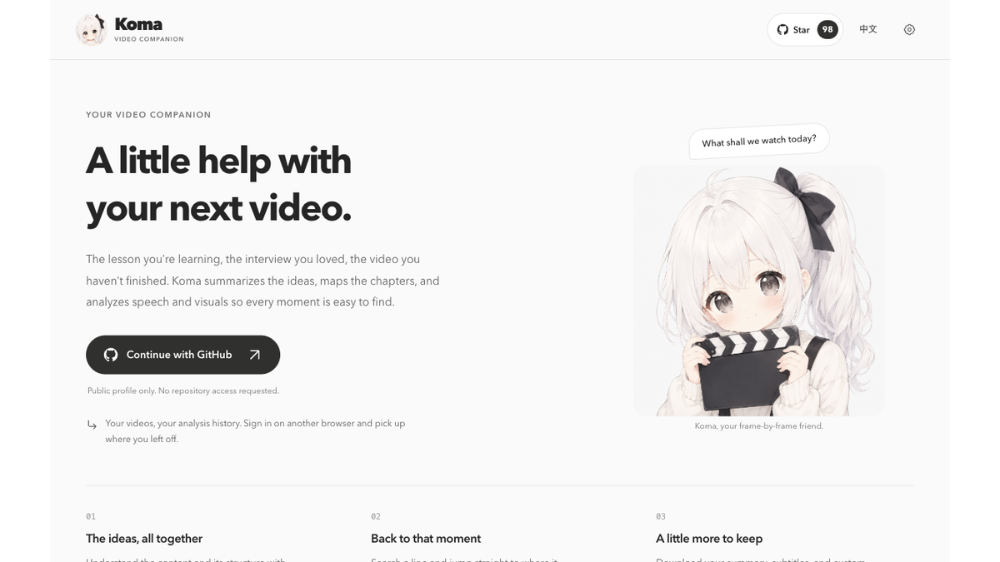
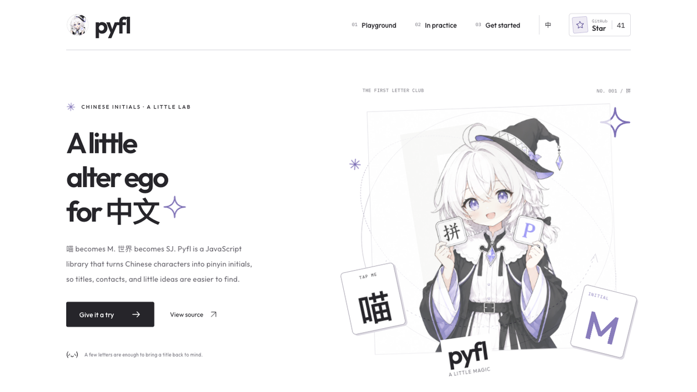
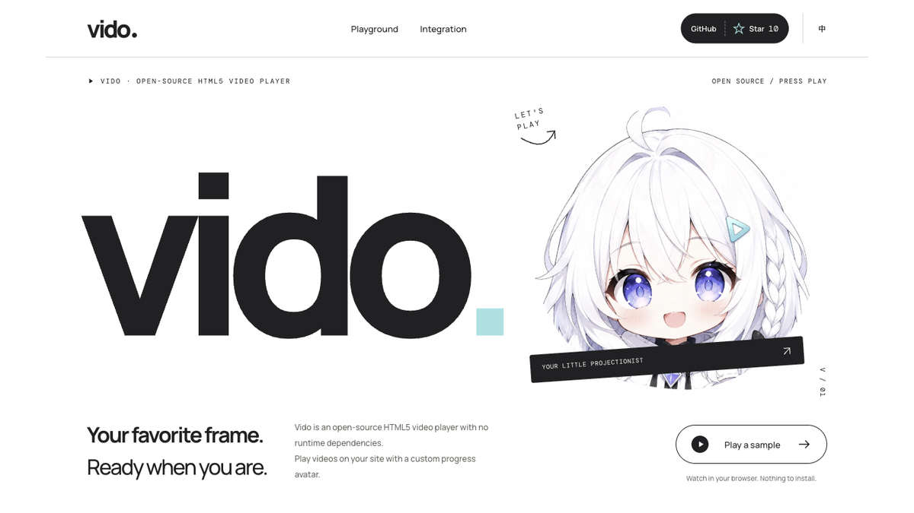
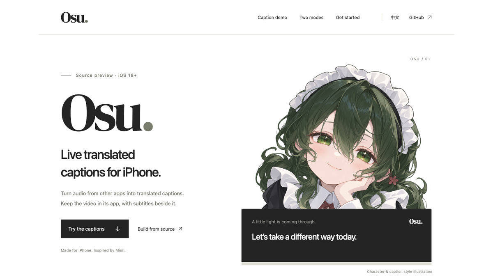

 
<a href="https://github.com/yuxino/kiri"><picture><source media="(prefers-color-scheme: dark)" srcset="assets/profile/gallery/compact/kiri-dark.svg"></picture></a>
<a href="https://github.com/yuxino/mimi"><picture><source media="(prefers-color-scheme: dark)" srcset="assets/profile/gallery/compact/mimi-dark.svg"></picture></a> 
<a href="https://kiri.yuxino.cn/"><picture><source media="(prefers-color-scheme: dark)" srcset="assets/profile/gallery/compact/link-dark.svg"></picture></a>
<a href="https://mimi.yuxino.cn/en/#demo"><picture><source media="(prefers-color-scheme: dark)" srcset="assets/profile/gallery/compact/link-dark.svg"></picture></a>

 
<a href="https://github.com/yuxino/fuwa"><picture><source media="(prefers-color-scheme: dark)" srcset="assets/profile/gallery/compact/fuwa-dark.svg"></picture></a>
<a href="https://github.com/yuxino/tick"><picture><source media="(prefers-color-scheme: dark)" srcset="assets/profile/gallery/compact/tick-dark.svg"></picture></a> 
<a href="https://fuwa.yuxino.cn/"><picture><source media="(prefers-color-scheme: dark)" srcset="assets/profile/gallery/compact/link-dark.svg"></picture></a>
<a href="https://tick.yuxino.cn/en/"><picture><source media="(prefers-color-scheme: dark)" srcset="assets/profile/gallery/compact/link-dark.svg"></picture></a>

 
<a href="https://github.com/yuxino/koma"><picture><source media="(prefers-color-scheme: dark)" srcset="assets/profile/gallery/compact/koma-dark.svg"></picture></a>
<a href="https://github.com/yuxino/pyfl"><picture><source media="(prefers-color-scheme: dark)" srcset="assets/profile/gallery/compact/pyfl-dark.svg"></picture></a> 
<a href="https://koma.yuxino.cn/"><picture><source media="(prefers-color-scheme: dark)" srcset="assets/profile/gallery/compact/link-dark.svg"></picture></a>
<a href="https://pyfl.yuxino.cn/"><picture><source media="(prefers-color-scheme: dark)" srcset="assets/profile/gallery/compact/link-dark.svg"></picture></a>

 
<a href="https://github.com/yuxino/vido"><picture><source media="(prefers-color-scheme: dark)" srcset="assets/profile/gallery/compact/vido-dark.svg"></picture></a>
<a href="https://github.com/yuxino/osu"><picture><source media="(prefers-color-scheme: dark)" srcset="assets/profile/gallery/compact/osu-dark.svg"></picture></a> 
<a href="https://vido.yuxino.cn/en.html"><picture><source media="(prefers-color-scheme: dark)" srcset="assets/profile/gallery/compact/link-dark.svg"></picture></a>
<a href="https://osu-web.yuxino.cn/en.html"><picture><source media="(prefers-color-scheme: dark)" srcset="assets/profile/gallery/compact/link-dark.svg"></picture></a>

[Satori](https://github.com/yuxino/satori) · [Blue Whale Maid](https://github.com/yuxino/dsh-blue-whale-maid) · [Koe](https://github.com/yuxino/koe) · [Viva](https://github.com/yuxino/viva) · [Doro](https://github.com/yuxino/doro) · [WeChat](https://github.com/yuxino/WeChat) · [2048](https://github.com/yuxino/2048)
