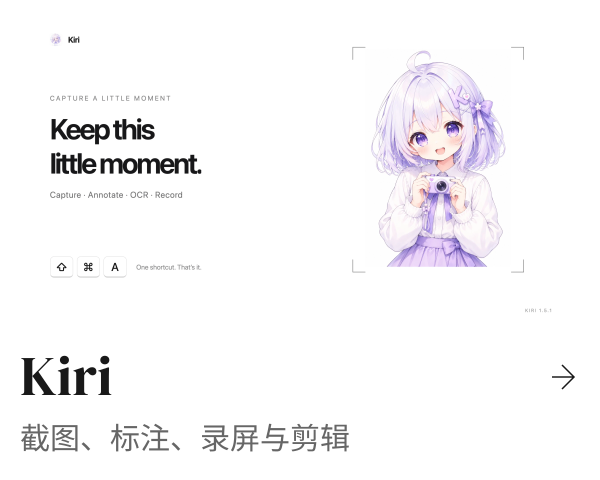
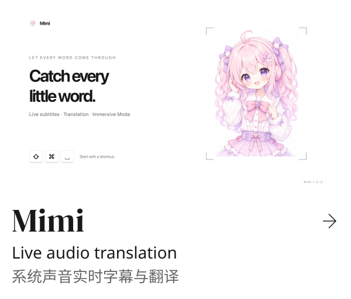
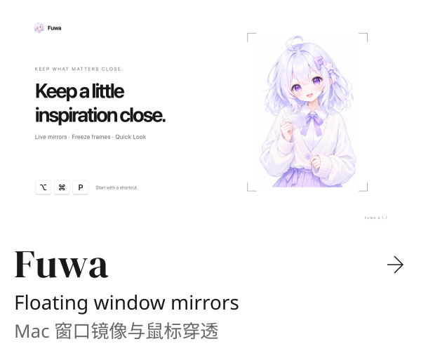
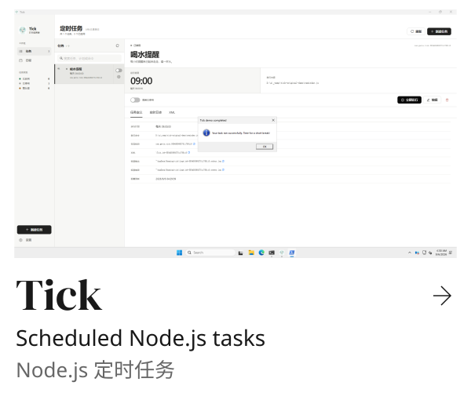
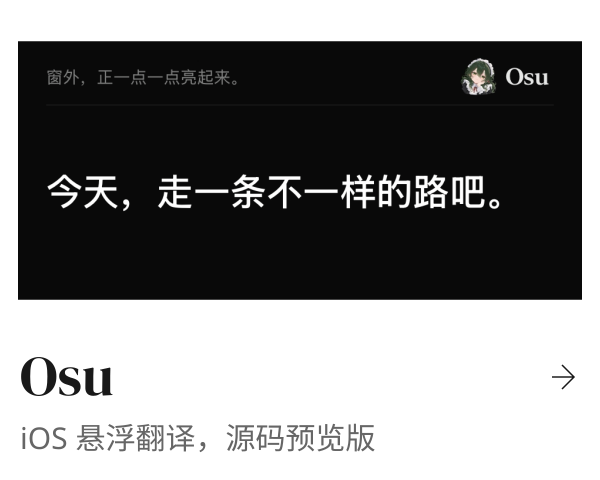
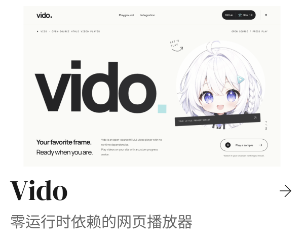
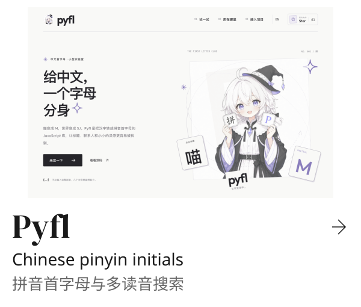

<a href="https://github.com/yuxino/kiri"><picture><source media="(prefers-color-scheme: dark)" srcset="assets/profile/gallery/kiri-dark.svg"></picture></a>
<a href="https://github.com/yuxino/mimi"><picture><source media="(prefers-color-scheme: dark)" srcset="assets/profile/gallery/mimi-dark.svg"></picture></a> 
<a href="https://kiri.yuxino.cn/"><picture><source media="(prefers-color-scheme: dark)" srcset="assets/profile/gallery/link-kiri-dark.svg"></picture></a>
<a href="https://mimi.yuxino.cn/en/#demo"><picture><source media="(prefers-color-scheme: dark)" srcset="assets/profile/gallery/link-mimi-dark.svg"></picture></a>

<a href="https://github.com/yuxino/satori"><picture><source media="(prefers-color-scheme: dark)" srcset="assets/profile/gallery/satori-dark.svg"></picture></a>
<a href="https://github.com/yuxino/fuwa"><picture><source media="(prefers-color-scheme: dark)" srcset="assets/profile/gallery/fuwa-dark.svg"></picture></a> 
<a href="https://satori.yuxino.cn/"><picture><source media="(prefers-color-scheme: dark)" srcset="assets/profile/gallery/link-satori-dark.svg"></picture></a>
<a href="https://fuwa.yuxino.cn/"><picture><source media="(prefers-color-scheme: dark)" srcset="assets/profile/gallery/link-fuwa-dark.svg"></picture></a>

<a href="https://github.com/yuxino/tick"><picture><source media="(prefers-color-scheme: dark)" srcset="assets/profile/gallery/tick-dark.svg"></picture></a>
<a href="https://github.com/yuxino/osu"><picture><source media="(prefers-color-scheme: dark)" srcset="assets/profile/gallery/osu-dark.svg"></picture></a> 
<a href="https://tick.yuxino.cn/"><picture><source media="(prefers-color-scheme: dark)" srcset="assets/profile/gallery/link-tick-dark.svg"></picture></a>
<a href="https://github.com/yuxino/osu/blob/master/CONTRIBUTING.md"><picture><source media="(prefers-color-scheme: dark)" srcset="assets/profile/gallery/link-osu-dark.svg"></picture></a>

<a href="https://github.com/yuxino/koma"><picture><source media="(prefers-color-scheme: dark)" srcset="assets/profile/gallery/koma-dark.svg"></picture></a>
<a href="https://github.com/yuxino/vido"><picture><source media="(prefers-color-scheme: dark)" srcset="assets/profile/gallery/vido-dark.svg"></picture></a> 
<a href="https://koma.yuxino.cn/"><picture><source media="(prefers-color-scheme: dark)" srcset="assets/profile/gallery/link-koma-dark.svg"></picture></a>
<a href="https://vido.yuxino.cn/en.html"><picture><source media="(prefers-color-scheme: dark)" srcset="assets/profile/gallery/link-vido-dark.svg"></picture></a>

<a href="https://github.com/yuxino/pyfl"><picture><source media="(prefers-color-scheme: dark)" srcset="assets/profile/gallery/pyfl-dark.svg"></picture></a>
<a href="https://github.com/yuxino/dsh-blue-whale-maid"><picture><source media="(prefers-color-scheme: dark)" srcset="assets/profile/gallery/dsh-blue-whale-maid-dark.svg"></picture></a> 
<a href="https://pyfl.yuxino.cn/"><picture><source media="(prefers-color-scheme: dark)" srcset="assets/profile/gallery/link-pyfl-dark.svg"></picture></a>
<a href="https://whale.yuxino.cn/"><picture><source media="(prefers-color-scheme: dark)" srcset="assets/profile/gallery/link-dsh-blue-whale-maid-dark.svg"></picture></a>

[Koe](https://github.com/yuxino/koe) · [Viva](https://github.com/yuxino/viva) · [Doro](https://github.com/yuxino/doro) · [WeChat](https://github.com/yuxino/WeChat) · [2048](https://github.com/yuxino/2048)
